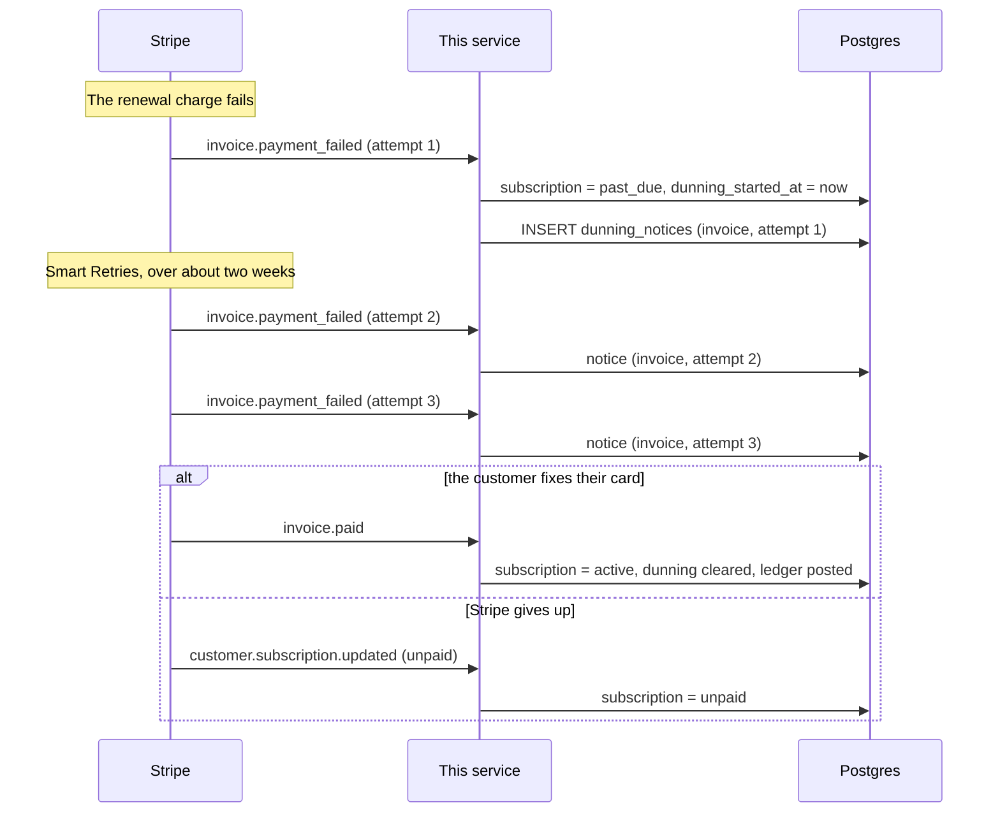

# A failed renewal

## Why `past_due` and not cancellation

Most failed renewals recover. Stripe's Smart Retries try the card again over
roughly two weeks, on a schedule tuned to when cards are likeliest to work.
Cancelling on the first failure throws away most of the subscriptions that
would have paid, and it is not reversible from the customer's side without
re-subscribing.

`past_due` says what is actually true: not paid, not given up on.

## The two guards

**One notice per invoice per attempt.** A redelivered `invoice.payment_failed`
carries the same `attempt_count`, and the unique key on
`(invoice_id, attempt)` is what stops the customer being emailed twice about
the same failure. That is a bug that reaches support before it reaches a log.

**A stale event cannot undo a recovery.** Stripe makes no ordering promise. A
retried `past_due` arriving after the `active` that resolved it would put a
paying customer back into dunning, and the only thing separating the two is the
event's own `created` timestamp — which the handler compares against the last
one applied.

## What replaces test clocks

Test clocks make Stripe emit this sequence over a simulated month. What this
service consumes _is_ the sequence, so `test/replay/dunning.test.ts` delivers
the events directly. That is a weaker test of Stripe and an equal test of the
handlers.

The assumption it cannot check is whether the real sequence still looks like
this — which is exactly what `test/live/` is for, and which has never run here.
