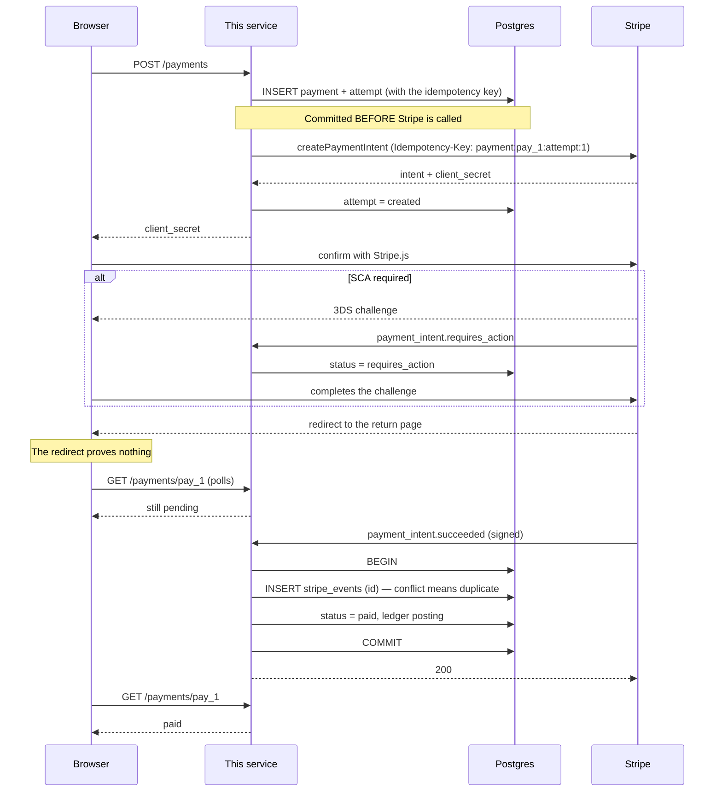

# A one-off payment

## The two decisions in that diagram

**The attempt row is written before the Stripe call.** A crash between the call
and the local write is then recoverable: the retry finds the attempt, reuses its
idempotency key, and Stripe returns the original intent rather than creating a
second one. Writing the attempt afterwards is the version that double-charges,
and it reviews identically.

**The redirect is not evidence.** The customer can close the tab, the browser
can be killed, the return URL can be typed by hand — none of it changes whether
money moved. The return page polls a status that only a verified webhook can
change. This is the single most common way a Stripe integration ships a bug
that only appears when it matters.

## Failure paths

| what happens                                | what the service does                                                                                   |
| ------------------------------------------- | ------------------------------------------------------------------------------------------------------- |
| Stripe call times out                       | the attempt stays `errored`; a retry reuses the key                                                     |
| the process dies mid-call                   | same — the key is already committed                                                                     |
| the customer abandons the challenge         | the payment stays `requires_action` forever, and reconciliation never sees a balance transaction for it |
| `succeeded` is delivered twice              | the second insert conflicts on the event id; the ledger is posted once                                  |
| `succeeded` arrives after `charge.refunded` | the transition table refuses `refunded → paid`                                                          |
| the card is declined                        | `payment_intent.payment_failed` → `failed`; no ledger posting, because no money moved                   |

## Ledger

A successful charge of 1000 with a 59 fee:

| account           | amount |
| ----------------- | -----: |
| `stripe_clearing` |   +941 |
| `fees`            |    +59 |
| `revenue`         |  −1000 |

Forgetting the fee is how a ledger comes to disagree with the bank by exactly
Stripe's cut, and the zero-sum check is what catches it.
