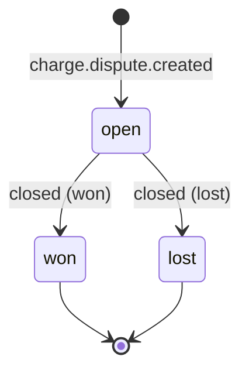

# Refunds and disputes

## Refunds

Validated locally before the call:

```ts
const remaining = payment.amount - payment.refunded; // SELECT ... FOR UPDATE
if (amount > remaining) throw new RefundTooLargeError(amount, remaining);
```

Stripe would reject an over-refund too. Doing it locally first means a round
trip saved, an error message that does not need translating, and — the part
that matters — no race. Two concurrent refunds each checking against Stripe
would both look valid; `FOR UPDATE` makes them queue.

**`amount_refunded` is cumulative.** The event reports the total refunded so
far, not the size of this refund. Treating it as the latter double-counts the
moment a second partial arrives, and the books then disagree with Stripe by the
size of the first one. The handler posts the delta:

```
delta = event.amount_refunded − payments.refunded
if (delta <= 0) return          // a redelivery reports the same total
```

That subtraction is also the ordering guard for refunds: it needs no
timestamp, because a duplicate produces a delta of zero.

## Disputes



| event  | posting                                           |
| ------ | ------------------------------------------------- |
| opened | `dispute_hold` +amount, `stripe_clearing` −amount |
| won    | `dispute_hold` −amount, `stripe_clearing` +amount |
| lost   | `dispute_hold` −amount, `dispute_loss` +amount    |

**A hold, not a loss.** Posting the loss when the dispute opens understates the
balance for weeks and then has to be reversed when the dispute is won — and
reversals in a ledger are exactly the entries nobody can interpret six months
later. The hold says what is true: this amount is contested.

The close handler updates `WHERE closed_at IS NULL`, so a redelivered close
posts nothing.
